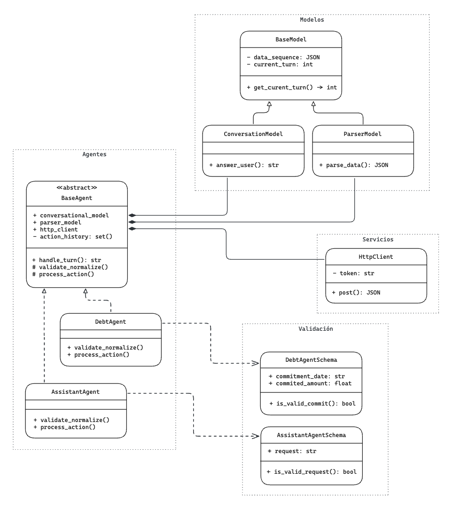

       ▜ ▗    ▐     ▜▜  ▐        ▌     ▗       ▜                 ▐            ▐
    ▞▀▖▐ ▄ ▛▀▖▜▀ ▞▀▖▐▐  ▜▀ ▞▀▖▞▀▖▛▀▖▛▀▖▄ ▞▀▖▝▀▖▐  ▝▀▖▞▀▘▞▀▘▞▀▖▞▀▘▜▀ ▛▚▀▖▞▀▖▛▀▖▜▀
    ▌ ▖▐ ▐ ▌ ▌▐ ▖▛▀ ▐▐  ▐ ▖▛▀ ▌ ▖▌ ▌▌ ▌▐ ▌ ▖▞▀▌▐  ▞▀▌▝▀▖▝▀▖▛▀ ▝▀▖▐ ▖▌▐ ▌▛▀ ▌ ▌▐ ▖
    ▝▀  ▘▀▘▘ ▘ ▀ ▝▀▘ ▘▘  ▀ ▝▀▘▝▀ ▘ ▘▘ ▘▀▘▝▀ ▝▀▘ ▘ ▝▀▘▀▀ ▀▀ ▝▀▘▀▀  ▀ ▘▝ ▘▝▀▘▘ ▘ ▀

> **SDE - 1** clintell's technical assestment

### 1. Descripción general de la prueba

El presente repositorio pretende ser una propuesta de solución para el problema expuesto por Clintell.
El objetivo de la prueba era implementar un sistema de agentes conversacionales que
a partir de las entradas del usuario extraigan información de interés y la redirijan a endpoints simulados.

### 2. Diseño del sistema y decisiones técnicas



El sistema implementa una arquitectura organizada en 4 capas: Modelos, Agentes, Validación y Servicios. El diseño propuesto prioriza la extensibilidad mediante abstracción y el bajo acoplamiento.

##### Decisiones técnicas relevantes:

1. **Patrón Template Method**: la clase abstracta `BaseAgent` define el flujo de gestión de turnos (`handle_turn()`) y las instancias `DebtAgent` y `AssistantAgent` implementan la especialización específica para la validación, normalización (`_validate_normalize()`) y el procesamiento (`_process_action()`) de la información que les llega. Esto garantiza la consistecia en su ciclo de vida y la posibilidad de añadir nuevos agentes sin duplicidad de código (Principio Apertura/Cierre).

2. **Prevención de Información Duplicada**: Cada Agente tiene un `_action_history: set()` que guarda un record de entradas validadas con `frozenset()` para prevenir el procesamiento de información duplicada.

3. **Externalización de la Validación**: para desacoplar la validación de la información que les llega a los agentes se han implementado Schemas de validación pydantic (Principio de Responsabilidad Única).

4. **Inyección de Dependencias**: los agentes reciben `ConversationModel`, `ParserModel` y `HttpClient` por constructor, lo que facilita el testing mediante mocks y reduce el acoplamiento entre capas.

### 3. Estructura del proyecto

```
clintell-technical-assessment/
├── src/
│   ├── base.py                    # Clase abstracta BaseAgent
│   ├── agents/
│   │   ├── debt.py                # Clase DebtAgent
│   │   └── assistant.py           # Clase AssistantAgent
│   ├── models/
│   │   ├── schemas.py             # Schemas Pydantic
│   │   └── mocks.py               # Mocks ConversationModel/ParserModel
│   └── services/
│       └── http_client.py         # Mock Cliente HTTP
├── tests/
│   ├── unit/                      # Tests unitarios
│   │   ├── test_schemas.py
│   │   ├── test_http_client.py
│   │   └── test_mocks.py
│   ├── integration/               # Tests de integración
│   │   ├── test_debt_flow.py
│   │   └── test_assistant_flow.py
│   └── conftest.py
├── main.py                        # Demo ejecutable (gameloop simulado)
├── conftest.py                    # Configuración ruta base para los Tests
├── requirements.txt               # Dependencias proyecto
├── .env.example
├── .gitignore
└── README.md
```

### 5. Ejecutar demo local

### 6. Tests ?? no se si incluir esto
